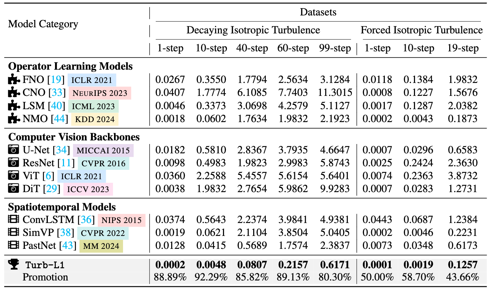

 # <p align=center> Turb-L1: Achieving Long-term Turbulence Tracing By Tackling Spectral Bias</p>
<p align="center" width="100%">
  
</p>

<p align="center">
<a href="https://arxiv.org/html/2505.19038v1" alt="arXiv">
    </a>
<a href="https://github.com/easylearningscores/Triton_AI4Earth/blob/main/LICENSE" alt="license">
    </a>
</p>

This repo is the official PyTorch implementation of Turb-L1.


## 📑 Datas
| Dataset       | Geometry        | Link                                                         |  Original Data shape | 
| -------------  | --------------- | ------------------------------------------------------------ |------------------------------------------------------------
| Decaying Isotropic Turbulence       | Regular Grid    | [[Hugging Face]](https://huggingface.co/datasets/scaomath/navier-stokes-dataset/blob/main/McWilliams2d_fp32_128x128_N1280_Re5000_T100.pt) | (1280, 100, 128, 128) |
| Forced Isotropic Turbulence         | Regular Grid    | [[Google Cloud]](https://drive.google.com/drive/folders/1UnbQh2WWc6knEHbLn-ZaXrKUZhp7pjt-) |  (1200, 64, 64, 20)  |


Here's a brief description of the datasets:

**Dataset 1**  
- Original dimensions: 1,280 samples × 100 timesteps  
- Spatial resolution: 128×128  
- Training strategy: 1-step prediction (1→1)  
- Inference strategy: Multi-step prediction (1→99)  
- Variable: Vorticity (single variable)

**Dataset 2**  
- Original dimensions: 1,200 samples × 20 timesteps  
- Spatial resolution: 64×64  
- Training strategy: 1-step prediction (1→1)  
- Inference strategy: Multi-step prediction (1→19)  
- Variable: Vorticity (single variable)


The expected output dimensions of the dataloader are as follows (Mode details can be found in [dataloader_McWilliams.py](https://github.com/easylearningscores/TurbL1_AI4Science/blob/main/dataloader_McWilliams.py)):
```bash
# --- Testing DataLoader Output ---

# Train DataLoader
train_input_shape = (32, 1, 1, 64, 64)  # (B, T_input, C, H, W)
train_target_shape = (32, 1, 1, 64, 64)  # (B, T_target, C, H, W)
batch_size = 32                          # B
input_timesteps = 1                      # T_input
channels = 1                             # C
height = 64                              # H
width = 64                               # W

# Validation DataLoader
val_input_shape = (32, 1, 1, 64, 64)    # (B, T_input, C, H, W)

# Test DataLoader
test_input_shape = (32, 1, 1, 64, 64)   # (B, T_input, C, H, W)
```
## 🔥 Get Started

- Core code: see [./turb_l1.py](https://github.com/easylearningscores/TurbL1_AI4Science/blob/main/model/turb_l1.py)

- Decaying Isotropic Turbulence Task:
  - Train file: see [train_McWilliams.py](https://github.com/easylearningscores/TurbL1_AI4Science/blob/main/train_McWilliams.py)
  - Inference file: see [inference_McWilliams.py](https://github.com/easylearningscores/TurbL1_AI4Science/blob/main/inference_McWilliams.py)
  - Parameters setting: see [config_McWilliams.yaml](https://github.com/easylearningscores/TurbL1_AI4Science/blob/main/config_McWilliams.yaml)


- Forced Isotropic Turbulence Task:
  - Train file: see [train_Forced_Li.py](https://github.com/easylearningscores/TurbL1_AI4Science/blob/main/train_Forced_Li.py)
  - Inference file: see [inference_Forced_Li.py](https://github.com/easylearningscores/TurbL1_AI4Science/blob/main/inference_Forced_Li.py)
  - Parameters setting: see [config_Forced_Li.yaml](https://github.com/easylearningscores/TurbL1_AI4Science/blob/main/config_Forced_Li.yaml)

you can run train code using this command:
```bash
torchrun --nnodes=1 --nproc_per_node=8 train_McWilliams.py
```

you can run inference code using this command:
```bash
python inference_McWilliams.py
```
## 🏆 Results

Trub-L1 achieves consistent state-of-the-art perfermance.
<p align="center">
   
<br><br>
<b>Table 1.</b> Performance comparison on isotropic turbulence datasets.
</p>


## 🏆 Showcase
<p align="center">
   
<br><br>
<b>Figure 1.</b> Long-term prediction on 2D Decaying Isotropic Turbulence.
</p>

## 🏆 Training Dynamics
<p align="center">
   
<br><br>
<b>Figure 2.</b> Evolution of spectral error and visual prediction improvement for Turb-L1 during training.
</p>

## 🤗 Citation

If you find this repo useful, please cite our paper. 

```
@article{wu2025turb,
  title={Turb-L1: Achieving Long-term Turbulence Tracing By Tackling Spectral Bias},
  author={Wu, Hao and Gao, Yuan and Shu, Ruiqi and Han, Zean and Xu, Fan and Zhu, Zhihong and Wen, Qingsong and Wu, Xian and Wang, Kun and Huang, Xiaomeng},
  journal={arXiv preprint arXiv:2505.19038},
  year={2025}
}
```
## ✉️ Contact

If you have any questions or want to use the code, please contact [wuhao2022@mail.ustc.edu.cn](mailto:wuhao2022@mail.ustc.edu.cn), [srq24@mails.tsinghua.edu.cn](mailto:srq24@mails.tsinghua.edu.cn).


##  📂 Acknowledgement

We appreciate the following github repos a lot for their valuable code base or datasets:

https://github.com/scaomath/torch-cfd

https://github.com/raj-brown/fourier_neural_operator


